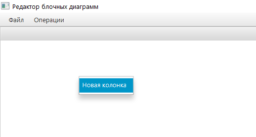
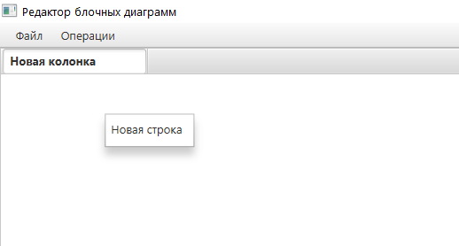
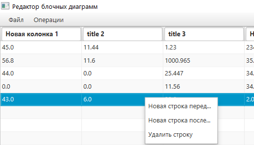
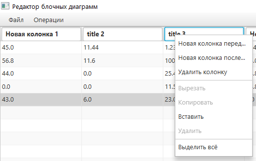
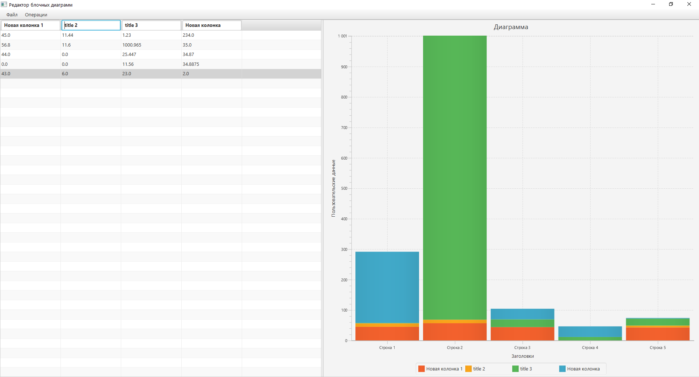

# Редактор блочных диаграмм

## Техническая информация
Архитектура: MVC
Применённый паттерн: Builder (для создания диаграммы)
View: JavaFX 15 (fxml)
Back: Java 13
Gradle: 4.12 (JVM 13)

Для запуска в Intellij Idea следует добавить конфигурацию (Add configuration -> Application), и установить класс Main и VM Option:
`--module-path "путь до библиотек JavaFX sdk(папка lib)" --add-modules=javafx.controls,javafx.fxml,javafx.graphics`

## Использование и скриншоты:
Есть возможность сохранения в файл и загрузки из него. Файл текстовый.
Взаимодействовать можно с верхним меню и с таблицей, а именно её контекстным меню(ПКМ - правая кнопка мыши). С верхним меню интуитивно понятно, а с таблицей по следующим правилам:
1. Если таблица пуста, то её контекстное меню содержит:

2. Если в таблице нет строк, то её контекстное меню содержит:

3. Если таблица не пуста, то добавить строку можно нажав ПКМ по строке:

4. Если таблица не пуста, то добавить столбец можно нажав ПКМ по заголовку столбца:

Скриншот работы:

